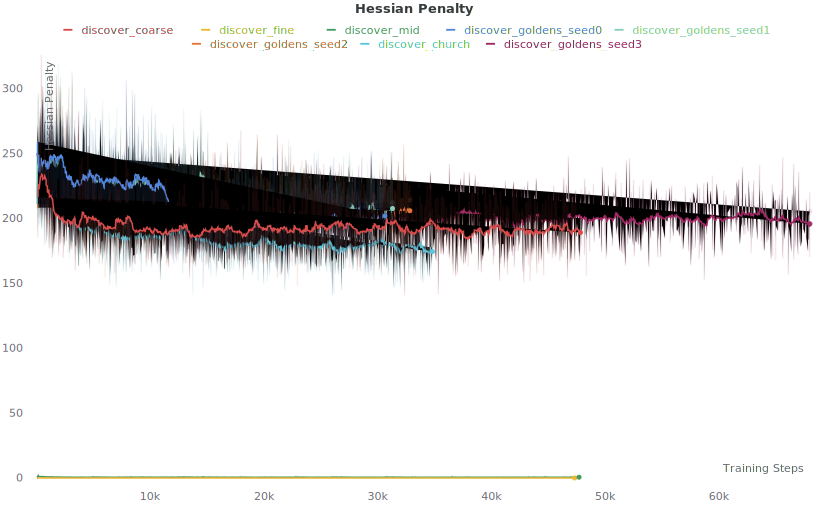

## The Hessian Penalty &mdash; BigGAN Direction Discovery

[Paper](https://arxiv.org/abs/2008.10599) | [Project Page](https://www.wpeebles.com/hessian-penalty) | [ECCV 2020 Spotlight Video](https://youtu.be/uZyIcTkSSXA) | [The Hessian Penalty in 90 Seconds](https://youtu.be/jPl-0EN6S1w)

[Home](../README.md) | PyTorch BigGAN Discovery | [TensorFlow ProGAN Regularization](../progan_experiments)


This repo contains a PyTorch implementation of direction discovery for BigGAN using the Hessian Penalty.

## Setup

Follow the simple setup instructions [here](../README.md#getting-started). The same environment works for both this repo as well as the ProgressiveGAN Hessian Penalty repo.

**Make sure you are using a recent version of PyTorch (>= 1.6.0); otherwise, you may have trouble loading our checkpoint directions. If you created a Conda environment with our old environment.yml file, you might have PyTorch 1.4.0. Be sure to upgrade in case.**

Our visualization and training scripts automatically download [a pre-trained BigGAN checkpoint](https://drive.google.com/file/d/1nAle7FCVFZdix2--ks0r5JBkFnKw8ctW/view) for you.

## Visualizing Pre-Trained Directions

This repo comes with pre-trained directions from the golden retrievers and churches experiments in our paper; see the [`checkpoints`](checkpoints) directory. To generate videos showcasing each learned direction, run one of the scripts in [`scripts/visualize`](scripts/visualize) (e.g., [`scripts/visualize/vis_goldens.sh`](scripts/visualize/vis_goldens.sh)). This will generate several videos demonstrating each of the learned directions. Each row corresponds to a different direction, and each column applies that direction to a different sampled image from the generator. For comparison, we also include pre-trained BigGAN directions from the [GAN Latent Discovery repo](https://github.com/anvoynov/GANLatentDiscovery); run [`scripts/visualize/vis_voynov.sh`](scripts/visualize/vis_voynov.sh) to visualize those.

You can add several options to the visualization command (see [`utils.py`](utils.py) for a full list):

* `--path_size` controls how "much" to move in the learned directions

* `--directions_to_vis` can be used to visualize just a subset of directions (e.g., `--directions_to_vis 0 5 86`)

* `--fix_class`, if specified, will only sample images from the given ImageNet class (you can find a mapping of class indices to human-readable labels [here](https://gist.github.com/yrevar/942d3a0ac09ec9e5eb3a))

* `--load_A` controls which directions checkpoint to load from; you can set it to `random` to visualize random orthogonal directions, `coords` to see what each individual z-component does, or set it to your own learned directions to visualize them

* `--val_minibatch_size` controls the batching for generating the videos; decrease this if you have limited GPU memory

For our method, we commonly find that certain interesting directions are found in the first 8 or 16 directions in the learned matrix, even across several random seeds. This is the case with the rotation direction, for example.

Note that BigGAN, by default, has quite a bit of innate disentanglement between the latent z vector and the class label. This means the directions tend to generalize well to other classes, so feel free to use a different `--fix_class` argument for visualizing samples of other categories in addition to categories you used for training.

## Running Direction Discovery (Training)

To start direction discovery, you can run one of the scripts in [`scripts/discover`](scripts/discover) (e.g., [`discover_goldens.sh`](scripts/discover/discover_goldens.sh), [`discover_mid.sh`](scripts/discover/discover_mid.sh), etc.). This will launch [`discover.py`](discover.py) which learns a matrix of shape `(ndirs, dim_z)`, where `ndirs` indicates the number of directions being learned.

Empirically, our method seems to produce quite consistent directions across seeds and training runs. To compare against our training runs, we include loss plots of the Hessian Penalty over the course of training for all discovery scripts (including multiple seeds for [`discover_goldens.sh`](scripts/discover/discover_goldens.sh)):



There are several training options you can play with (see [`utils.py`](utils.py) for a full list):

* `--G_path` can be set to a pre-trained BigGAN checkpoint to run discovery on (if set to the default value `None`, we will download a 128x128 model automatically for you)

* `--path_size` controls the distribution of sampled path sizes (this is `eta` in our paper)

* `--A_lr` controls the learning rate

* `--fix_class`, if specified, will restrict the sampled class input to the generator to the specified ImageNet class index. In our experiments, we restricted it to either `207` (golden retrievers) or `497` (churches), but you can try setting this argument to `None` and sampling classes randomly during training as well.

* `--ndirs` specifies the number of directions to be learned

* `--no_ortho` can be added to learn an unconstrained matrix of directions (by default, the directions are constrained to be orthogonal to prevent degenerate solutions)

* `--search_space` by default is set to `'all'`, which searches for directions in the entirety of z-space (which by default is 120-dimensional; this is the setting we used for the experiments reported in our paper). You can instead set `--search_space coarse` to search for directions in just the first 40 z-components, `--search_space mid` to search in the middle 40 z-components or `--search_space fine` to search in the final 40 z-components. This is in a similar spirit as "style mixing" in StyleGAN, where it is often beneficial to take advantage of the natural disentanglement learned by modern GANs. For example, the first 40 z-components in vanilla BigGAN mostly correspond with factors of variation related to object pose while the middle 40 z-components mainly control factors such as lighting and background. You can use this argument to take advantage of this natural disentanglement. Note that we include pre-trained directions for these settings (see [`vis_goldens_coarse.sh`](scripts/visualize/vis_goldens_coarse.sh), [`vis_goldens_mid.sh`](scripts/visualize/vis_goldens_mid.sh) and [`vis_goldens_fine.sh`](scripts/visualize/vis_goldens_fine.sh) in the scripts folder). The first two GIFs at the top of this README come from using `--search_space mid`.  

* `--wandb_entity` can be specified to enable logging to [Weights and Biases](https://wandb.com) (otherwise uses TensorBoard)

* `--vis_during_training` can be added to periodically log learned direction GIFs to WandB/TensorBoard

* `--batch_size` can be decreased if you run out of GPU memory (in our experiments, we used 4 GPUs with a batch size of 96)


## Directions from our Paper

Below are the indices for the directions we reported in our paper/presentations/GitHub. You can use `--directions_to_vis <indices>` to visualize these directions directly in their respective visualization scripts. Note that all results reported in our paper used `--search_space all` (i.e., did not leverage information about any innate disentanglement in BigGAN).

#### [Golden Retrievers (`--search_space all`)](scripts/visualize/vis_goldens.sh)
* Rotation: 5 (GIF shown above)
* Zoom: 6
* Smoosh: 8

#### [Golden Retrievers (`--search_space mid`)](scripts/visualize/vis_goldens_mid.sh)
* Background Removal: 0 (GIF shown above)
* Colorization: 5
* Scene Lighting: 8
* Object Lighting: 25 (GIF shown above)

#### [Golden Retrievers (`--search_space fine`)](scripts/visualize/vis_goldens_fine.sh)
* Red Color Filter: 1
* Brightness: 5
* White Color Filter: 13
* Saturation: 20

#### [Churches](scripts/visualize/vis_church.sh)
* Rotation: 4
* Shifting: 14
* Colorization: 55 (GIF shown above)

## Citation

If our code aides your research, please cite our [paper](https://arxiv.org/pdf/2008.10599.pdf):
```
@inproceedings{peebles2020hessian,
  title={The Hessian Penalty: A Weak Prior for Unsupervised Disentanglement},
  author={Peebles, William and Peebles, John and Zhu, Jun-Yan and Efros, Alexei A. and Torralba, Antonio},
  booktitle={Proceedings of European Conference on Computer Vision (ECCV)},
  year={2020}
}
```

## Acknowledgments

We thank Pieter Abbeel, Taesung Park, Richard Zhang, Mathieu Aubry, Ilija Radosavovic, Tim Brooks, Karttikeya Mangalam, and all of BAIR for valuable discussions and encouragement. This work was supported, in part, by grants from SAP, Adobe, and Berkeley DeepDrive.

This repo builds upon [Andy Brock's PyTorch BigGAN library](https://github.com/ajbrock/BigGAN-PyTorch). We thank him for open-sourcing his code. The original license can be found [here](BIGGAN_LICENSE).
