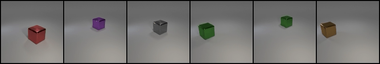

## The Hessian Penalty &mdash; ProgressiveGAN Regularization

[Paper](https://arxiv.org/abs/2008.10599) | [Project Page](https://www.wpeebles.com/hessian-penalty) | [ECCV 2020 Spotlight Video](https://youtu.be/uZyIcTkSSXA) | [The Hessian Penalty in 90 Seconds](https://youtu.be/jPl-0EN6S1w)

[Home](../README.md) | [PyTorch BigGAN Discovery](../biggan_discovery) | TensorFlow ProGAN Regularization



This repo contains a TensorFlow implementation of the Hessian Penalty regularizer applied to ProgressiveGAN.

## Setup

Follow the simple setup instructions [here](../README.md#getting-started). Note that the same environment works for both this repo as well as the BigGAN direction discovery repo.

## Visualizing and Evaluating Pre-Trained Models

Our code automatically takes care of downloading pre-trained models (and datasets). The main entry point for visualizations is [`visualize.py`](visualize.py). To generate a high-quality interpolation video in the `visuals` directory, which shows what each `z` component has learned, you can simply run:

```python
python visualize.py --models <DATASET>_<MODEL>
```

where `<DATASET>` is one of `edges_and_shoes`, `clevr_simple`, `clevr_complex`, `clevr_u` or `clevr_1fov` and `<MODEL>` is one of `ft`, `fs`, `info` or `bl`:

* `ft` means the model was fine-tuned with the Hessian Penalty
* `fs` means the model was trained from scratch with the Hessian Penalty
* `info` means the model was regularized with InfoGAN's loss term
* `bl` means the model is a vanilla ProGAN (the baseline method ProGAN+ in our paper)

For example, if you want to visualize the model fine-tuned with Hessian Penalty on Edges+Shoes, you would use `--models edges_and_shoes_ft`; the model checkpoint will be downloaded automatically to the `pretrained_models` folder. If you wish to evaluate your own `.pkl` checkpoints, you can instead supply a direct path to them using `--models`. You can also specify multiple checkpoints to generate visuals for them simultaneously. There are several visualization options; see [`visualize.py`](visualize.py) for details and documentation. You can find visualizations for 20 of our pre-trained models in the Complete Results section of our [project page](https://www.wpeebles.com/hessian-penalty).

To evaluate pre-trained models' PPLs and FIDs, you can use:

```python
python evaluate.py --model <DATASET>_<MODEL> --dataset <DATASET>
```
This command will automatically download both the model and dataset if needed and then evaluate FID and PPL. (Note that for `clevr_u` specifically, you should use `--model clevr_u_<MODEL> --dataset clevr_simple`, since `clevr_u` is just a model trained on `clevr_simple` with `nz=3`)

Finally, if you'd like to compute activeness score histograms (Figure 5 in our paper), the "diagonal-ness" of a model's Hessian (Table 2) or Hessian/Hessian Penalty visualizations (Appendices C and D), you can use [`figures.py`](figures.py):

```python
python figures.py --models <DATASET>_<MODEL> --fig <see below>
```

* `--fig hessians` will produce visualizations of your models' Hessian matrices
* `--fig diag --samples 100` will compute the two "diagonal-ness" metrics for your model
* `--fig heatmaps` will produce visualizations of per-pixel Hessian Penalty heatmaps overlaid on the corresponding fake images
* `--fig active --samples 300 --model_names <names for histograms> --dataset_names <titles for histograms>` will create activeness histograms for your models (see the top of [`figures.py`](figures.py) for an example)

Figures will be saved to `visuals` (except `--fig diag` that outputs directly to the console).

## Training and Fine-Tuning

If you'd like to train new models, the main entry point is [`train.py`](train.py). If you specify one of our datasets with the `--dataset` argument (`edges_and_shoes`, `clevr_simple`, `clevr_complex` or `clevr_1fov`), it will be automatically downloaded to the `datasets` folder. Alternatively, you can set-up your own datasets with:

```python
python dataset_tool.py create_from_images datasets/<pick_a_dataset_name> <path_to_folder_of_images>
```

There are several options related to the Hessian Penalty that can be controlled with command-line arguments. Some examples of arguments you can add:

* `hp_lambda`: Controls the loss weighting of the Hessian Penalty
* `layers_to_reg`: Controls which layers (1 through 13) are regularized by the Hessian Penalty
* `warmup_kimg`: When fine-tuning with the Hessian Penalty, controls how quickly the penalty is ramped-up
* `epsilon`: Controls granularity of finite differences approximation
* `num_rademacher_samples`: Controls how many samples are used to estimate the Hessian Penalty

We include the commands used to train Hessian Penalty models from scratch, vanilla models, and InfoGAN models in the [`training_scripts`](training_scripts) folder. For fine-tuning a pre-trained ProGAN with the Hessian Penalty (or just resuming an experiment), you can use the `--resume_exp` and `--resume_snapshot` arguments. For example, if you have a network `results/00011-my-experiment/network-snapshot-00500.pkl`, you can fine-tune it with:

```python
python train.py --resume_exp 11 --resume_snapshot 500 --hp_lambda 0.1 --warmup_kimg 10000 <plus any other command-line arguments you used to launch the original experiment you're fine-tuning from...>
```

To train a vanilla ProGAN, use `--hp_lambda 0`. To train with InfoGAN's regularizer, add `--infogan_lambda <loss_weighting> --infogan_nz <nz>`. This will regularize the first `nz` components of the `z` vector with InfoGAN's loss.

This code supports both Tensorboard and the [WandB](https://www.wandb.com/) dashboard. If you want to use WandB, specify `--dashboard_api wandb` and `--wandb_entity <entity/username>` in your call to `train.py`. Regardless of the dashboard you use, disentanglement visualizations, training losses, network checkpoints, and FID/PPL will be periodically computed and saved to `results`, which you can then view in your dashboard.

## Citation

If our code aided your research, please cite our [paper](https://arxiv.org/pdf/2008.10599.pdf):
```
@inproceedings{peebles2020hessian,
  title={The Hessian Penalty: A Weak Prior for Unsupervised Disentanglement},
  author={Peebles, William and Peebles, John and Zhu, Jun-Yan and Efros, Alexei A. and Torralba, Antonio},
  booktitle={Proceedings of European Conference on Computer Vision (ECCV)},
  year={2020}
}
```

## Acknowledgments

We thank Pieter Abbeel, Taesung Park, Richard Zhang, Mathieu Aubry, Ilija Radosavovic, Tim Brooks, Karttikeya Mangalam, and all of BAIR for valuable discussions and encouragement. This work was supported, in part, by grants from SAP, Adobe, and Berkeley DeepDrive.

This repo builds upon NVIDIA's excellent [StyleGAN-v1 TensorFlow library](https://github.com/NVlabs/stylegan). We thank the authors for open-sourcing their code. The original license can be found [here](NVIDIA-LICENSE.txt).
